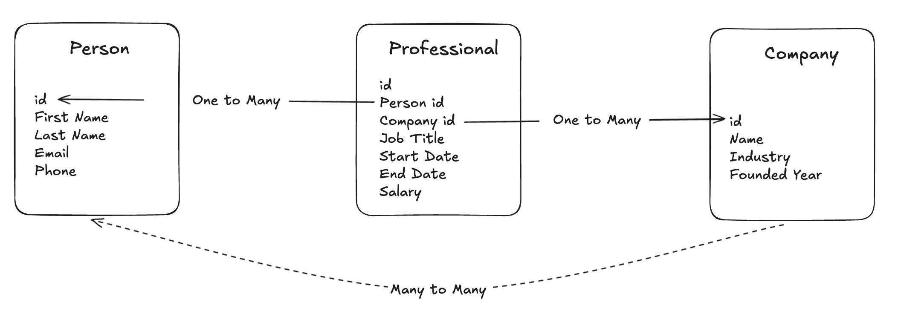
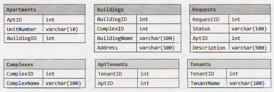

# Databases

Completed tasks:


<details>
<summary>DDL with Test Data</summary>

```SQL
-- Drop tables if exist (for clean slate)
DROP TABLE IF EXISTS AptTenants CASCADE;
DROP TABLE IF EXISTS Tenants CASCADE;
DROP TABLE IF EXISTS Requests CASCADE;
DROP TABLE IF EXISTS Apartments CASCADE;
DROP TABLE IF EXISTS Buildings CASCADE;
DROP TABLE IF EXISTS Complexes CASCADE;

-- Complexes: a complex may contain multiple buildings
CREATE TABLE Complexes (
    ComplexID   SERIAL PRIMARY KEY,
    ComplexName VARCHAR(255) NOT NULL
);

-- Buildings: each building belongs to one complex
CREATE TABLE Buildings (
    BuildingID   SERIAL PRIMARY KEY,
    BuildingName VARCHAR(255) NOT NULL,
    ComplexID    INT NOT NULL REFERENCES Complexes(ComplexID)
);

-- Apartments: each apartment belongs to one building (and thus to a complex implicitly)
CREATE TABLE Apartments (
    AptID      SERIAL PRIMARY KEY,
    BuildingID INT NOT NULL REFERENCES Buildings(BuildingID),
    UnitNumber VARCHAR(50) NOT NULL
);

-- Tenants: persons who may rent apartments
CREATE TABLE Tenants (
    TenantID   SERIAL PRIMARY KEY,
    TenantName VARCHAR(255) NOT NULL
);

-- AptTenants: many-to-many between Apartments and Tenants
-- An apartment can have multiple tenants, a tenant can rent multiple apartments
CREATE TABLE AptTenants (
    AptID    INT NOT NULL REFERENCES Apartments(AptID),
    TenantID INT NOT NULL REFERENCES Tenants(TenantID),
    PRIMARY KEY (AptID, TenantID)
);

-- Requests: maintenance / service requests from apartments
CREATE TABLE Requests (
    RequestID SERIAL PRIMARY KEY,
    AptID     INT NOT NULL REFERENCES Apartments(AptID),
    Status    VARCHAR(50) NOT NULL,
    Description TEXT
);

-- Insert complexes
INSERT INTO Complexes (ComplexName) VALUES
  ('Downtown Complex'),
  ('Riverside Gardens');

-- Insert buildings
INSERT INTO Buildings (BuildingName, ComplexID) VALUES
  ('Building A', 1),
  ('Building B', 1),
  ('Building C', 2);

-- Insert apartments
INSERT INTO Apartments (BuildingID, UnitNumber) VALUES
  (1, 'Apt 101'),
  (1, 'Apt 102'),
  (2, 'Apt 201'),
  (2, 'Apt 202'),
  (3, 'Apt 301');

-- Insert tenants
INSERT INTO Tenants (TenantName) VALUES
  ('Alice'),
  ('Bob'),
  ('Charlie'),
  ('Diana');

-- Assign tenants to apartments
INSERT INTO AptTenants (AptID, TenantID) VALUES
  (1, 1),  -- Alice in Apt 101
  (2, 2),  -- Bob in Apt 102
  (2, 3),  -- Charlie also in Apt 102 (shared)
  (3, 4),  -- Diana in Apt 201
  (4, 1),  -- Alice also rents Apt 202 (multiple apartments)
  (5, 4);  -- Diana in Apt 301

-- Create some requests
INSERT INTO Requests (AptID, Status, Description) VALUES
  (1, 'Open', 'Leaky faucet in kitchen'),
  (2, 'Closed', 'Broken window repaired'),
  (2, 'Open', 'Heating not working'),
  (4, 'Open', 'Light flickering in hallway'),
  (5, 'Closed', 'Door lock replaced');
```  
</details>

## 1. Multiple Apartments

Write a SQL query to get a list of tenants who are renting more than one apartment.

<details>
<summary>Solution</summary>

```SQL
SELECT t FROM tenants t INNER JOIN AptTenants at ON t.TenantID = at.TenantID GROUP BY t.TenantID HAVING count(t) > 1;
```
</details>
<hr/>

## 2. Open Requests

Write a SQL query to get a list of all buildings and the number of open requests (Requests in which status equals 'Open').

<details>
<summary>Solution</summary>

```SQL
SELECT BuildingName, COALESCE(req.c,0) as "Count" FROM Buildings b LEFT JOIN
(SELECT a.BuildingID, Count(*) as c FROM Requests r INNER JOIN apartments a ON a.AptID = r.AptID WHERE r.Status = 'Open' GROUP BY a.BuildingID) req
ON b.BuildingID = req.BuildingID
```
</details>
<hr/>

## 3. Close All Requests

Building #1 is undergoing a major renovation. Implement a query to close all requests from apartments in this building.
<details>
<summary>Solution</summary>

```SQL
UPDATE Requests SET Status = 'Closed' WHERE AptID IN
(SELECT AptID FROM Apartments WHERE BuildingID = '1');
```
</details>

<hr/>

## 4. Joins

What are the different types of joins? Please explain how they differ and why certain types are better in certain situations.

<details>
<summary>Answer</summary>
    
### INNER JOIN

Returns only rows that have matching keys in both tables. Used when you need intersecting data only.

### LEFT JOIN (LEFT OUTER JOIN)

Returns all rows from the left table and matching rows from the right table; unmatched rows from the right are returned as `NULL`.
Used when all data from the primary table must be preserved.

### RIGHT JOIN (RIGHT OUTER JOIN)

Returns all rows from the right table and matching rows from the left table; unmatched rows from the left are returned as `NULL`.
Same concept as LEFT JOIN but with the right table as the anchor. Less commonly used.

### FULL OUTER JOIN

Returns all rows from both tables. Matches are joined, and non-matching rows from either side are filled with `NULL`.
Used when you need a complete union of both datasets.

### CROSS JOIN

Returns the Cartesian product of the two tables (each row in table A paired with each row in table B).
Used for generating combinations; not dependent on matching keys.

### SELF JOIN

A table joined with itself, typically via aliases.
Used to compare rows within the same table (e.g., hierarchical relationships like employee → manager) or handy for duplicate searches.

### SEMI JOIN (`EXISTS`)

Returns rows from table A when a match exists in table B but does not duplicate table A rows based on the number of matches.
Used when you need to filter by existence without retrieving data from the joined table.

### ANTI JOIN (`NOT EXISTS` / `LEFT JOIN … WHERE B IS NULL`)

Returns rows from table A only when no match exists in table B.
Used for finding missing/unmatched records.

### NATURAL JOIN

Rarelly used. Long story short: Inner Join without `ON` clause.

</details>
<hr/>

## 5. Denormalization

What is denormalization? Explain the pros. and cons.

<details>
<summary>Answer</summary>

### Denormalization

Denormalization is the intentional process of reversing database normalization by adding redundancy or merging tables to improve read performance. In other words, it moves a schema from higher normal forms toward lower normal forms to reduce the need for complex joins.

### Pros

- Faster read/query performance (fewer joins and lookups).
- Better for analytics and reporting workloads.
- Can reduce expensive JOIN operations in high-traffic systems.
- Improves caching efficiency because data is grouped together.

### Cons

- Data redundancy increases → more storage required.
- Higher risk of data inconsistency because the same data exists in multiple places.
- More complex write operations due to the need to update redundant data.
- Harder to maintain and enforce data integrity over time.
</details>

<hr/>

## 6. Entity-Relationship Diagram

Draw an entity-relationship diagram for a database with companies, people, and professionals (people who work for companies).

<details>
<summary>Answer</summary>
    

</details>

<hr/>

## 7. Design Grade Database

Imagine a simple database storing information for students' grades. Design what this database might look like and provide a SQL query to
return a list of the honor roll students (top 10%), sorted by their grade point average.


<details>
<summary>Example Data</summary>
    
```sql
DROP TABLE IF EXISTS students;
DROP TABLE IF EXISTS courses;
DROP TABLE IF EXISTS marks;

CREATE TABLE students (
    student_id INT PRIMARY KEY,
    first_name VARCHAR(50),
    last_name VARCHAR(50)
);

CREATE TABLE courses (
    course_id INT PRIMARY KEY,
    course_name VARCHAR(100)
);

CREATE TABLE marks (
    student_id INT,
    course_id INT,
    grade DECIMAL(3,2), -- 0.00–4.00 scale
    PRIMARY KEY (student_id, course_id),
    FOREIGN KEY (student_id) REFERENCES students(student_id),
    FOREIGN KEY (course_id) REFERENCES courses(course_id)
);

INSERT INTO students (student_id, first_name, last_name) VALUES
(1, 'Alice', 'Nguyen'),
(2, 'Brian', 'Smith'),
(3, 'Carla', 'Lopez'),
(4, 'Daniel', 'Kim'),
(5, 'Elena', 'Patel'),
(6, 'Frank', 'Johnson'),
(7, 'Grace', 'Chen'),
(8, 'Henry', 'Brown'),
(9, 'Isabella', 'Garcia'),
(10, 'Jack', 'Wilson');


INSERT INTO courses (course_id, course_name) VALUES
(101, 'Mathematics'),
(102, 'Computer Science'),
(103, 'History'),
(104, 'Physics');

INSERT INTO marks (student_id, course_id, grade) VALUES
-- Alice
(1, 101, 4.00),
(1, 102, 3.90),
(1, 103, 3.80),

-- Brian
(2, 101, 3.20),
(2, 102, 3.50),
(2, 104, 3.40),

-- Carla
(3, 101, 3.90),
(3, 102, 4.00),
(3, 104, 3.80),

-- Daniel
(4, 101, 3.50),
(4, 103, 3.60),
(4, 104, 3.70),

-- Elena
(5, 101, 4.00),
(5, 102, 4.00),
(5, 103, 3.90),

-- Frank
(6, 101, 4.00),
(6, 103, 4.00),
(6, 104, 3.90),

-- Grace
(7, 101, 3.70),
(7, 102, 3.80),
(7, 104, 3.90),

-- Henry
(8, 101, 3.00),
(8, 102, 3.20),
(8, 103, 3.10),

-- Isabella
(9, 101, 3.85),
(9, 102, 3.90),
(9, 104, 4.00),

-- Jack
(10, 101, 3.40),
(10, 103, 3.50),
(10, 104, 3.60);
```
</details>

<details>
<summary>Solution</summary>

```sql
WITH gpa AS (
    SELECT
        s.student_id,
        s.first_name,
        s.last_name,
        AVG(m.grade) AS gpa
    FROM students s
    JOIN marks m ON m.student_id = s.student_id
    GROUP BY s.student_id, s.first_name, s.last_name
)
SELECT *
FROM gpa
WHERE gpa >= (
    SELECT MIN(gpa)
    FROM (
        SELECT gpa
        FROM gpa
        ORDER BY gpa DESC
        LIMIT CEILING((SELECT COUNT(*) FROM gpa) * 0.10)
    ) t
)
ORDER BY gpa DESC;
```
</details>
<hr/>


## Database Schema



