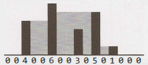

# Hard

Completed tasks:


## 1. Add Without Plus

Write a function that adds two numbers. You should not use `+` or any arithmetic operators.

<details>
<summary>Naive Solution</summary>

At first, we can show a naive solution that interviewers will probably not accept. But it actually meets the
requirements.

#### Complexity

Time Complexity: `O(1)`

Space Complexity: `O(1)`

#### Implementation

```kotlin
fun sumNumbers(a: Int, b: Int) = arrayOf(a, b).sum()
```

</details>

<details>
<summary>Naive Real Solution</summary>

We can iterate over the bits in the numbers and make a logical sum. It is not the most efficient solution.
The main problem is to handle the carry bit.

#### Complexity

Time Complexity: `O(1)` - we have a loop, but it is always in const range of bits

Space Complexity: `O(1)`

#### Implementation

```kotlin

fun sum32(a: Int, b: Int): Int {
    var carryBit = false

    var bitMaskPosition = 1
    var result = 0
    while (bitMaskPosition != 0) { // when bitMaskPosition is 0, it is actually an overflow
        val aBit = (a and bitMaskPosition) != 0
        val bBit = (b and bitMaskPosition) != 0

        when {
            !aBit && !bBit -> {
                if (carryBit) {
                    result = result or bitMaskPosition
                    carryBit = false
                }
            }

            (aBit && !bBit) || (!aBit && bBit) -> {
                if (carryBit) {
                    // do nothing
                } else {
                    result = result or bitMaskPosition
                }
            }

            aBit && bBit /*else*/ -> {
                if (carryBit) {
                    result = result or bitMaskPosition
                } else {
                    carryBit = true
                }
            }
        }

        bitMaskPosition = bitMaskPosition shl 1
    }

    return result
}
```

</details>

<details>
<summary>Optimized Solution</summary>

We can iterate over the bits in the numbers and make a logical sum. It is not the most efficient solution.
The main problem is to handle the carry bit.

#### Complexity

Time Complexity: `O(1)` - we have a loop, but it is always in const range of bits

Space Complexity: `O(1)`

#### Implementation

```kotlin
fun optimizedSum32(a: Int, b: Int): Int {
    var a = a
    var b = b
    while (b != 0) {
        val sum = a xor b // суммирование без переноса
        val carry = (a and b) shl 1 // перенос без суммирования
        a = sum
        b = carry
    }
    return a
}
```

</details>

<hr/>

## 2. Shuffle

Write a method to shuffle a deck of cards. It must be a perfect shuffle-in other words, each of the 52! permutations of
the deck has to be equally likely. Assume that you are given a random number generator which is perfect.

<details>
<summary>Naive Solution</summary>

We can rely on kotlin (JVM) implementation.

#### Complexity

Time Complexity: `O(N)`
Space Complexity: `O(N)`

#### Implementation

```kotlin
fun stupidShuffleCards(cards: List<Int>): List<Int> = cards.shuffled()
```

</details>

<details>
<summary>Naive Real Solution</summary>

#### Complexity

Time Complexity: `O(N)` - we iterate over cards list and then remove one element from it until list is not empty

Space Complexity: `O(N)`

#### Implementation

```kotlin
val randomGenerator = Random
fun shuffleCards(cards: MutableList<Int>): List<Int> {
    val shuffledCards: MutableList<Int> = mutableListOf()
    while (cards.isNotEmpty()) {
        val index = randomGenerator.nextInt(cards.size)
        shuffledCards.add(cards.removeAt(index))
    }

    return shuffledCards
}
```

</details>

<details>
<summary>Optimized Solution</summary>

#### Complexity

Time Complexity: `O(N)` - we iterate over cards list and then remove one element from it until list is not empty

Space Complexity: `O(1)`

#### Implementation

```kotlin
fun shuffleCardsInplace(cards: MutableList<Int>): List<Int> {
    for (index in cards.indices) {
        val randomIndex = randomGenerator.nextInt(cards.size)
        val temp = cards[randomIndex]
        cards[randomIndex] = cards[index]
        cards[index] = temp
    }

    return cards
}
```

</details>

<hr/>

## 3. Random Set

Write a method to randomly generate a set of m integers from an array of size n. Each element must have equal
probability of being chosen.

<details>
<summary>Naive Solution</summary>

#### Complexity

Time Complexity: `O(m)`

Space Complexity: `O(m)`

#### Implementation

```kotlin
val randomGenerator = Random(0)
fun randomSubset(nums: List<Int>, m: Int): List<Int> {
    if (m > nums.size) {
        error("Subset can't be constructed")
    }
    val subset = ArrayList<Int>(m)
    val copyOfOriginalList = nums.toMutableList()

    repeat(m) {
        val randomIndex = randomGenerator.nextInt(copyOfOriginalList.size)
        subset.add(copyOfOriginalList.removeAt(randomIndex))
    }

    return subset
}
```

</details>

<details>
<summary>Optimized Solution</summary>

#### Complexity

Time Complexity: `O(N)`

Space Complexity: `O(m)`

#### Implementation

```kotlin
fun optimizedRandomSubset(nums: List<Int>, m: Int): List<Int> {
    if (m > nums.size) {
        error("Subset can't be constructed")
    }

    val subset = Array(m) { i -> nums[i] }

    var i = m
    while (i < nums.size) {
        val randomIndex = randomGenerator.nextInt(i)
        if (randomIndex < m) {
            subset[randomIndex] = nums[i]
        }
        ++i
    }

    return subset.toList()
}
```

</details>

<hr/>

## 4. Missing Number

An array `A` contains all the integers from 0 to n, except for one number which is missing. In this problem, we cannot
access an entire integer in A with a single operation. The elements of A are represented in binary, and the only
operation we can use to access them is `fetch the j-th bit of A[i]`, which takes constant time.
Write code to find the missing integer. Can you do it in `O(N)` time?

<details>
<summary>Solution</summary>

#### Complexity

Time Complexity: `O(N)`

Space Complexity: `O(N log N)`

#### Implementation

```kotlin
fun missingNumber(array: List<BitInteger>, index: Int): Int {
    if (index > 31) {
        return 0
    }

    val listCapacity = array.size / 2
    val zeroes = ArrayList<BitInteger>(listCapacity)
    val ones = ArrayList<BitInteger>(listCapacity)

    for (currentValue in array) {
        if (currentValue.fetch(index) == 1) {
            ones.add(currentValue)
        } else {
            zeroes.add(currentValue)
        }
    }

    val missedBit = if (zeroes.size <= ones.size) 0 else 1
    val nextCandidate = if (missedBit == 0) zeroes else ones
    val value = missingNumber(nextCandidate, index + 1)

    return value or (missedBit shl index)
}
```

</details>

<hr/>

## 5. Letters and Numbers

Given an array filled with letters and numbers, find the longest subarray with an equal number of letters and numbers.

<details>
<summary>Naive Solution</summary>

#### Complexity

Time Complexity: `O(N)`

Space Complexity: `O(N)`

#### Implementation

```kotlin
fun longestBalancedSubarray(arr: Array<Char>): Pair<Int, Int> {
    val deltas = Array(arr.size) { -1 }

    var prefixSum = 0
    var maxLen = 0
    var result: Pair<Int, Int> = Pair(0, 0)

    for (i in arr.indices) {
        if (arr[i].isLetter()) ++prefixSum else --prefixSum

        val currentDelta = deltas[prefixSum]
        if (currentDelta != -1) {
            val start = currentDelta + 1
            val length = i - currentDelta
            if (length > maxLen) {
                maxLen = length
                result = Pair(start, i)
            }
        } else {
            deltas[prefixSum] = i
        }
    }

    return result
}
```

</details>

<details>
<summary>Solution</summary>

#### Complexity

Time Complexity: `O(N^2)`

Space Complexity: `O(1)`

#### Implementation

```kotlin
fun findLongestSubarray(array: CharArray): CharArray? {
    for (len in array.size downTo 2) {
        for (i in 0..array.size - len) {
            val end = i + len - 1
            if (hasEqualLettersNumbers(array, i, end)) {
                return extractSubarray(array, i, end)
            }
        }
    }
    return null
}

fun hasEqualLettersNumbers(
    array: CharArray,
    start: Int,
    end: Int
): Boolean {
    var counter = 0
    for (i in start..end) {
        if (array[i].isLetter()) counter++ else counter--
    }
    return counter == 0
}

fun extractSubarray(
    array: CharArray,
    start: Int,
    end: Int
): CharArray {
    val subarray = CharArray(end - start + 1)
    for (i in start..end) {
        subarray[i - start] = array[i]
    }
    return subarray
}
```

</details>

<details>
<summary>Optimized Solution</summary>

#### Complexity

Time Complexity: `O(N)`

Space Complexity: `O(N)`

#### Implementation

```kotlin
fun findLongestSubarrayOptimized(array: CharArray): CharArray {
    val deltas = computeDeltaArray(array)
    val match = findLongestMatch(deltas)
    return extractSubarray(array, match[0] + 1, match[1])
}

fun findLongestMatch(deltas: IntArray): IntArray {
    val map = mutableMapOf<Int, Int>()
    map[0] = -1

    val max = IntArray(2)

    for (i in deltas.indices) {
        if (!map.containsKey(deltas[i])) {
            map[deltas[i]] = i
        } else {
            val match = map[deltas[i]]!!
            val distance = i - match
            val longest = max[1] - max[0]

            if (distance > longest) {
                max[1] = i
                max[0] = match
            }
        }
    }

    return max
}


fun computeDeltaArray(array: CharArray): IntArray {
    val deltas = IntArray(array.size)
    var delta = 0

    for (i in array.indices) {
        when {
            array[i].isLetter() -> delta++
            array[i].isDigit() -> delta--
        }
        deltas[i] = delta
    }

    return deltas
}
```

</details>

<hr/>

## 6. Count of 2s

Write a method to count the number of 2s that appear in all the numbers between 0 and n (inclusive).

### Example

```
Input: 
    25

Output: 
    9 (2, 12, 20, 21, 22, 23, 24 and 25. Note that 22 counts for two 2s.)
```

<details>
<summary>Naive Solution</summary>

#### Complexity

Time Complexity: `O(Len(N))` - where Len(N) - it is a number of 10th factors in N

Space Complexity: `O(1)`

#### Implementation

```kotlin
fun countOfTwos(n: Int): Int {
    if (n < 2) return 0

    var count = 0
    var factor = 1

    while (n / factor != 0) {
        val lower = n % factor
        val current = (n / factor) % 10
        val higher = n / (factor * 10)

        count += when {
            current < 2 -> higher * factor
            current == 2 -> higher * factor + lower + 1
            else -> (higher + 1) * factor
        }

        factor *= 10
    }

    return count
}
```

</details>

<details>
<summary>Solution</summary>

#### Complexity

Time Complexity: `O(Len(N))` - where Len(N) - it is a number of 10th factors in N

Space Complexity: `O(1)`

#### Implementation

```kotlin
fun countOfTwosFromBook(n: Int): Int {
    var count = 0
    val len = n.toString().length
    for (digit in 0..<len) {
        count += count2sInRangeAtDigit(n, digit)
    }

    return count
}

fun count2sInRangeAtDigit(number: Int, d: Int): Int {
    val powerOf10 = 10.0.pow(d)
    val nextPowerOf10 = powerOf10 * 10
    val right = number % powerOf10

    val roundDown = number - number % nextPowerOf10
    val roundUp = roundDown + nextPowerOf10
    val digit = (number / powerOf10) % 10

    val count = if (digit < 2) {
        roundDown / 10
    } else if (digit.toInt() == 2) {
        roundDown / 10 + right + 1
    } else {
        roundUp / 10
    }

    return count.toInt()
}
```

</details>

<hr/>

## 7. Baby Names

Each year, the government releases a list of the 10000 most common baby names and their frequencies (the number of
babies with that name).
The only problem with this is that some names have multiple spellings. For example, "John" and "Jon" are essentially the
same name but would
be listed separately in the list. Given two lists, one of names/frequencies and the other of pairs of equivalent names,
write an algorithm
to print a new list of the true frequency of each name. Note that if John and Jon are synonyms, and Jon and Johnny are
synonyms, then John
and Johnny are synonyms. (It is both transitive and symmetric.) In the final list, any name can be used as the "real"
name.

### Example

```
Input: 
    Names: John (15), Jon (12), Chris (13), Kris (4), Christopher (19)
    Synonyms: (Jon, John), (John, Johnny), (Chris, Kris), (Chris, Christopher) 
Output: 
    John (27), Kris (36) 
```

<details>
<summary>Naive Solution</summary>

#### Complexity

Time Complexity: `O(N)`
- Let `S` be the number of synonym pairs. The dominant operation is union. Each union performs two find operations, so the total number of find calls is `2S + N`.

Space Complexity: `O(N)`

#### Implementation

```kotlin
class UnionFind {
    private val namesMap = mutableMapOf<String, String>()

    fun find(name: String): String {
        namesMap.putIfAbsent(name, name)
        if (namesMap[name] != name) {
            namesMap[name] = find(namesMap[name]!!)
        }
        return namesMap[name]!!
    }

    fun union(first: String, second: String) {
        val left = find(first)
        val right = find(second)
        if (left != right) {
            namesMap[right] = left
        }
    }
}

fun mergeNamesNaive(
    names: Map<String, Int>,
    synonyms: List<Pair<String, String>>
): Map<String, Int> {
    val unionFind = UnionFind()

    for ((first, second) in synonyms) {
        unionFind.union(first, second)
    }

    val result = mutableMapOf<String, Int>()
    for ((name, freq) in names) {
        val root = unionFind.find(name)
        result[root] = result.getOrDefault(root, 0) + freq
    }

    return result
}
```

</details>

<details>
<summary>Solution</summary>

#### Complexity

Time Complexity: `O(N log N)`

Space Complexity: `O(N)`

#### Implementation

```kotlin
class NameSet(name: String, freq: Int) {

    private val names: MutableSet<String> = mutableSetOf()
    var frequency: Int = 0
        private set
    var rootName: String
        private set

    init {
        names.add(name)
        frequency = freq
        rootName = name
    }

    fun copyNamesWithFrequency(more: Set<String>, freq: Int) {
        names.addAll(more)
        frequency += freq
    }

    fun getNames(): Set<String> = names
    fun size(): Int = names.size
}

fun convertToMap(
    groups: MutableMap<String, NameSet>
): Map<String, Int> {
    val result = mutableMapOf<String, Int>()

    for (group in groups.values) {
        result[group.rootName] = group.frequency
    }

    return result
}

fun constructGroups(
    names: Map<String, Int>
): MutableMap<String, NameSet> {
    val groups = mutableMapOf<String, NameSet>()

    for ((name, frequency) in names) {
        val group = NameSet(name, frequency)
        groups[name] = group
    }

    return groups
}

fun mergeClasses(
    groups: MutableMap<String, NameSet>,
    synonyms: Array<Pair<String, String>>
) {
    for ((name1, name2) in synonyms) {
        val set1 = groups[name1]
        val set2 = groups[name2]

        if (set1 != null && set2 != null && set1 !== set2) {
            val smaller = if (set2.size() < set1.size()) set2 else set1
            val bigger = if (set2.size() < set1.size()) set1 else set2
            val otherNames = smaller.getNames()
            val frequency = smaller.frequency
            bigger.copyNamesWithFrequency(otherNames, frequency)

            for (name in otherNames) {
                groups[name] = bigger
            }
        }
    }
}
```

</details>

<details>
<summary>Optimized Solution</summary>

### Complexity

Time Complexity: `O(N)`

Space Complexity: `O(N)`

### Implementation

```kotlin
class GraphNode(
    val name: String,
    val frequency: Int
) {
    private val neighbors: MutableList<GraphNode> = mutableListOf()
    var visited: Boolean = false

    fun addNeighbor(node: GraphNode) {
        neighbors.add(node)
    }

    fun getNeighbors(): List<GraphNode> = neighbors
}

class Graph {

    private val nodes: MutableMap<String, GraphNode> = mutableMapOf()

    fun createNode(name: String, frequency: Int) {
        if (!nodes.containsKey(name)) {
            nodes[name] = GraphNode(name, frequency)
        }
    }

    fun addEdge(name1: String, name2: String) {
        val node1 = nodes[name1]
        val node2 = nodes[name2]

        if (node1 != null && node2 != null) {
            node1.addNeighbor(node2)
            node2.addNeighbor(node1)
        }
    }

    fun getNodes(): Collection<GraphNode> = nodes.values
}

fun getComponentFrequency(node: GraphNode): Int {
    if (node.visited) return 0

    node.visited = true

    var sum = node.frequency
    for (child in node.getNeighbors()) {
        sum += getComponentFrequency(child)
    }

    return sum
}

fun getTrueFrequencies(graph: Graph): Map<String, Int> {
    val rootNames = mutableMapOf<String, Int>()

    for (node in graph.getNodes()) {
        if (!node.visited) {
            val frequency = getComponentFrequency(node)
            val name = node.name
            rootNames[name] = frequency
        }
    }

    return rootNames
}

fun connectEdges(
    graph: Graph,
    synonyms: Array<Pair<String, String>>
) {
    for ((name1, name2) in synonyms) {
        graph.addEdge(name1, name2)
    }
}

fun constructGraph(names: Map<String, Int>): Graph {
    val graph = Graph()
    for ((name, frequency) in names) {
        graph.createNode(name, frequency)
    }
    return graph
}
```

</details>

<hr/>

## 8. Circus Tower

A circus is designing a tower routine consisting of people standing atop one another's shoulders. For practical and
aesthetic reasons, each
person must be both shorter and lighter than the person below him or her. Given the heights and weights of each person
in the circus, write
a method to compute the largest possible number of people in such a tower.

### Example

```
Input: 
    (ht, wt): (65, 100) (70, 150) (56, 90) (75, 190) (60, 95) (68, 110) 
Output: 
    The longest tower is length 6 and includes from top to bottom: 
    (56, 90) (60,95) (65,100) (68,110) (70,150) (75,190)
```

<details>
<summary>Naive Solution</summary>

#### Complexity

Time Complexity: `O(N^2)`

Space Complexity: `O(N)`

#### Implementation

```kotlin
fun longestTower(people: List<Pair<Int, Int>>): List<Pair<Int, Int>> {
    if (people.isEmpty()) return emptyList()

    val sorted = people.sortedWith(
        compareBy<Pair<Int, Int>> { it.first }.thenBy { it.second }
    )

    val n = sorted.size
    val dp = IntArray(n) { 1 }
    val prev = IntArray(n) { -1 }

    var maxIndex = 0

    for (i in 0 until n) {
        for (j in 0 until i) {
            if (sorted[j].second < sorted[i].second && dp[j] + 1 > dp[i]) {
                dp[i] = dp[j] + 1
                prev[i] = j
            }
        }
        if (dp[i] > dp[maxIndex]) {
            maxIndex = i
        }
    }

    val result = mutableListOf<Pair<Int, Int>>()
    var curr = maxIndex
    while (curr != -1) {
        result.add(sorted[curr])
        curr = prev[curr]
    }

    return result.reversed()
}
```

</details>

<details>
<summary>Solution</summary>

#### Complexity

Time Complexity: `O(N^2)`

Space Complexity: `O(N)`

#### Implementation

```kotlin
data class HtWt(
    val height: Int,
    val weight: Int
) : Comparable<HtWt> {

    override fun compareTo(other: HtWt): Int {
        return if (height != other.height) {
            height.compareTo(other.height)
        } else {
            weight.compareTo(other.weight)
        }
    }

    fun isBefore(other: HtWt): Boolean {
        return height < other.height && weight < other.weight
    }

    override fun toString(): String {
        return "($height, $weight)"
    }
}

fun longestIncreasingSeq(items: MutableList<HtWt>): List<HtWt> {
    items.sort()
    return bestSeqAtIndex(items, ArrayList(), 0)
}

fun canAppend(
    solution: List<HtWt>,
    value: HtWt
): Boolean {
    if (solution.isEmpty()) return true

    val last = solution[solution.size - 1]
    return last.isBefore(value)
}

fun bestSeqAtIndex(
    array: MutableList<HtWt>,
    sequence: List<HtWt>,
    index: Int
): List<HtWt> {
    if (index >= array.size) return sequence

    val value = array[index]

    var bestWith: List<HtWt>? = null

    if (canAppend(sequence, value)) {
        val sequenceWith = ArrayList(sequence)
        sequenceWith.add(value)
        bestWith = bestSeqAtIndex(array, sequenceWith, index + 1)
    }

    val bestWithout = bestSeqAtIndex(array, sequence, index + 1)

    return if (bestWith == null || bestWithout.size > bestWith.size) {
        bestWithout
    } else {
        bestWith
    }
}
```

</details>

<details>
<summary>Optimized Solution</summary>

#### Complexity

Time Complexity: `O(N^2)`

Space Complexity: `O(N)`

#### Implementation

```kotlin
fun max(
    seq1: ArrayList<HtWt>?,
    seq2: ArrayList<HtWt>?
): ArrayList<HtWt> {
    return when {
        seq1 == null -> seq2 ?: ArrayList()
        seq2 == null -> seq1
        seq1.size > seq2.size -> seq1
        else -> seq2
    }
}

fun longestIncreasingSeq(array: ArrayList<HtWt>): ArrayList<HtWt> {
    array.sort()

    val solutions = ArrayList<ArrayList<HtWt>>()
    var bestSequence: ArrayList<HtWt>? = null

    for (i in array.indices) {
        val longestAtIndex = bestSeqAtIndex(array, solutions, i)
        solutions.add(i, longestAtIndex)
        bestSequence = max(bestSequence, longestAtIndex)
    }

    return bestSequence ?: ArrayList()
}


fun bestSeqAtIndex(
    array: ArrayList<HtWt>,
    solutions: ArrayList<ArrayList<HtWt>>,
    index: Int
): ArrayList<HtWt> {

    val value = array[index]
    var bestSequence = ArrayList<HtWt>()

    for (i in 0 until index) {
        val solution = solutions[i]
        if (canAppend(solution, value)) {
            bestSequence = max(solution, bestSequence)
        }
    }

    val best = ArrayList(bestSequence)
    best.add(value)

    return best
}
```

</details>

<details>
<summary>Very Optimized Solution</summary>

#### Complexity

Time Complexity: `O(N log N)`

Space Complexity: `O(N)`

#### Implementation

Fun fact: all the solutions above have O(N²) time complexity. Here, we partially store the tails and use binary search.

```kotlin
fun longestTowerTails(people: List<Pair<Int, Int>>): List<Pair<Int, Int>> {
    if (people.isEmpty()) return emptyList()

    val sorted = people.sortedWith(
        compareBy<Pair<Int, Int>> { it.first }.thenBy { it.second }
    )

    val n = sorted.size
    val tails = IntArray(n)
    val prev = IntArray(n) { -1 }

    var size = 0

    for (i in 0 until n) {
        var left = 0
        var right = size

        while (left < right) {
            val mid = (left + right) / 2
            if (sorted[tails[mid]].second < sorted[i].second) {
                left = mid + 1
            } else {
                right = mid
            }
        }

        if (left > 0) {
            prev[i] = tails[left - 1]
        }

        tails[left] = i

        if (left == size) {
            size++
        }
    }

    val result = ArrayList<Pair<Int, Int>>()
    var index = tails[size - 1]

    while (index != -1) {
        result.add(sorted[index])
        index = prev[index]
    }

    return result.reversed()
}
```
</details>

<hr/>

## 9. Kth Multiple

Design an algorithm to find the kth number such that the only prime factors are 3, 5, and 7. Note that 3, 5, and 7 do
not have to be
factors, but it should not have any other prime factors. For example, the first several multiples would be (in order) 1,
3, 5, 7, 9, 15, 21.

### Example

```
Output: 
    the first several multiples would be (in order) 1, 3, 5, 7, 9, 15, 21
```

<details>
<summary>Naive Solution</summary>

#### Complexity

Time Complexity: `O(K)`
Space Complexity: `O(K)`

#### Implementation

```kotlin
fun kthMultiple(k: Int): Array<Int> {
    val dp = Array(k) { 1 }

    var i3 = 0
    var i5 = 0
    var i7 = 0

    var next3 = 3
    var next5 = 5
    var next7 = 7

    for(i in 1..<k){
        val min = min(min(next3, next5), next7)

        dp[i] = min

        if (min == next3) next3 = dp[++i3] * 3
        if (min == next5) next5 = dp[++i5] * 5
        if (min == next7) next7 = dp[++i7] * 7
    }

    return dp
}
```

</details>

<details>
<summary>Solution</summary>

#### Complexity

Time Complexity: `O(K^3 log(K^3))`
Space Complexity: `O(K)`

#### Implementation

```kotlin
fun dumbKthMultiple(k: Int): List<Int> {
    val possibilities = allPossibleKFactors(k)
    possibilities.sort()
    return possibilities.take(k)
}

fun allPossibleKFactors(k: Int): MutableList<Int> {
    val values = mutableListOf<Int>()

    for (a in 0..k) { // loop for 3
        val powA = 3.0.pow(a.toDouble()).toInt()

        for (b in 0..k) { // loop for 5
            val powB = 5.0.pow(b.toDouble()).toInt()

            for (c in 0..k) { // loop for 7
                val powC = 7.0.pow(c.toDouble()).toInt()

                var value = powA * powB * powC

                // Overflow check
                if (value < 0 ||
                    powA == Int.MAX_VALUE ||
                    powB == Int.MAX_VALUE ||
                    powC == Int.MAX_VALUE
                ) {
                    value = Int.MAX_VALUE
                }

                values.add(value)
            }
        }
    }
    return values
}
```
</details>

<details>
<summary>Optimized Solution</summary>

#### Complexity

Time Complexity: `O(K)`

Space Complexity: `O(K)`

#### Implementation

```kotlin
fun getKthMagicNumber(k: Int): Int {
    var value = 0

    val queue3: Queue<Int> = LinkedList()
    val queue5: Queue<Int> = LinkedList()
    val queue7: Queue<Int> = LinkedList()

    queue3.add(1)

    repeat(k) {
        val v3 = queue3.peek()
        val v5 = if (queue5.isNotEmpty()) queue5.peek() else Int.MAX_VALUE
        val v7 = if (queue7.isNotEmpty()) queue7.peek() else Int.MAX_VALUE

        value = minOf(v3, v5, v7)

        when (value) {
            v3 -> {
                queue3.poll()
                queue3.add(3 * value)
                queue5.add(5 * value)
            }
            v5 -> {
                queue5.poll()
                queue5.add(5 * value)
            }
            v7 -> {
                queue7.poll()
            }
        }

        queue7.add(7 * value)
    }

    return value
}
```
</details>

<hr/>

## 10. Majority Element

A majority element is an element that makes up more than half of the items in an array. Given a positive integers array,
find the majority
element. If there is no majority element, return `-1`. Do this in `O(N)` time and `0(1)` space.

### Example

```
Input: 
    1 2 5 9 5 9 5 5 5
Output: 
    5
```

<details>
<summary>Solution</summary>

#### Complexity

Time Complexity: `O(N)`

Space Complexity: `O(1)`

#### Implementation

```kotlin
fun findMajorityElement(array: IntArray): Int {
    val candidate = getCandidate(array)
    return if (validate(array, candidate)) candidate else -1
}

fun getCandidate(array: IntArray): Int {
    var majority = 0
    var count = 0

    for (n in array) {
        if (count == 0) { // no dominant element
            majority = n
        }

        if (n == majority) {
            count++
        } else {
            count--
        }
    }
    return majority
}

fun validate(array: IntArray, majority: Int): Boolean {
    var count = 0

    for (n in array) {
        if (n == majority) {
            count++
        }
    }

    return count > array.size / 2
}
```
</details>

<hr/>

## 11. Word Distance

You have a large text file containing words. Given any two words, find the shortest distance (in terms of number of
words) between them in the file. If the operation is repeated many times for the same file (but different pairs of words), 
can you optimize your solution?

<details>
<summary>Solution</summary>

#### Complexity

Time Complexity: `O(N)`

Space Complexity: `O(N)`

#### Implementation

```kotlin
class WordDistance(words: List<String>) {

    private val indexMap: Map<String, MutableList<Int>>

    init {
        val map = mutableMapOf<String, MutableList<Int>>()
        for (i in words.indices) {
            map.computeIfAbsent(words[i]) { mutableListOf() }.add(i)
        }
        indexMap = map
    }

    fun shortest(word1: String, word2: String): Pair<Int, Int> {
        val list1 = indexMap[word1] ?: return -1 to -1
        val list2 = indexMap[word2] ?: return -1 to -1

        var i = 0
        var j = 0
        var minDistance = Int.MAX_VALUE

        var bestPositions = -1 to -1
        
        while (i < list1.size && j < list2.size) {
            val pos1 = list1[i]
            val pos2 = list2[j]

            val distance = abs(pos1 - pos2)
            if (distance < minDistance) {
                bestPositions = pos1 to pos2
                minDistance = distance
            }

            if (pos1 < pos2) {
                i++
            } else {
                j++
            }
        }

        return bestPositions
    }
}
```
</details>

<hr/>

## 12. BiNode

Consider a simple data structure called BiNode, which has pointers to two other nodes.

```java
public class BiNode {
    public BiNode node1, node2;
    public int data;
}
```

The data structure BiNode could be used to represent both a binary tree (where node1 is the left node and node2 is the
right node) or a doubly linked list (where node` is the previous node and node2 is the next node). 
Implement a method to convert a binary search tree (implemented with BiNode) into a doubly linked list. 
The values should be kept in order and the operation should be performed in place (that is, on the original data structure).

<details>
<summary>Naive Solution</summary>

#### Complexity

Time Complexity: `O(N)`

Space Complexity: `O(H)` - recursion. H - height of the tree.

#### Implementation

```kotlin
class BiNode(
    var data: Int,
    var node1: BiNode? = null,
    var node2: BiNode? = null
)

class BSTToDoublyLinkedList {
    private var prev: BiNode? = null
    private var head: BiNode? = null

    fun toDoubleLinkedList(root: BiNode?): BiNode? {
        inorder(root)
        return head
    }

    private fun inorder(node: BiNode?) {
        if (node == null) return

        inorder(node.node1)

        val currentPrev = prev
        if (currentPrev == null) {
            head = node
        } else {
            currentPrev.node2 = node
            node.node1 = currentPrev
        }
        prev = node

        inorder(node.node2)
    }
}
```
</details>

<details>
<summary>Solution</summary>

#### Complexity

Time Complexity: `O(N)`

Space Complexity: `O(H)` - recursion. H - height of the tree.

#### Implementation

```kotlin
class BiNode(
    var data: Int,
    var node1: BiNode? = null,
    var node2: BiNode? = null
)

fun convert(root: BiNode?): BiNode? {
    val head = convertToCircular(root) ?: return null

    // Break the circular links
    head.node1!!.node2 = null
    head.node1 = null

    return head
}

private fun convertToCircular(root: BiNode?): BiNode? {
    if (root == null) return null

    val part1 = convertToCircular(root.node1)
    val part3 = convertToCircular(root.node2)

    if (part1 == null && part3 == null) {
        root.node1 = root
        root.node2 = root
        return root
    }

    /* Connect left part with root */
    if (part1 == null) {
        concat(part3!!.node1!!, root)
    } else {
        concat(part1.node1!!, root)
    }

    /* Connect right part with root */
    if (part3 == null) {
        concat(root, part1!!)
    } else {
        concat(root, part3)
    }

    val tail3 = part3?.node1
    /* Connect right part with left part */
    if (part1 != null && part3 != null) {
        concat(tail3!!, part1)
    }

    return part1 ?: root
}

private fun concat(a: BiNode, b: BiNode) {
    a.node2 = b
    b.node1 = a
}
```
</details>

<hr/>

## 13. Re-Space

Oh, no! You have accidentally removed all spaces, punctuation, and capitalization in a lengthy document. A sentence
like "I reset the
computer. It still didn't boot!"
became "iresetthecomputeritstilldidntboot". You'll deal with the punctuation and capitalization later; right now you
need to re-insert the
spaces. Most of the words are in a dictionary, but a few are not. Given a dictionary (a list of strings) and the
document (a string), design
an algorithm to unconcatenate the document in a way that minimizes the number of unrecognized characters.

### Example

```
Input: 
    jesslookedjustliketimherbrother 
Output: 
    jess looked just like tim her brother (7 unrecognized characters)
    ----                  ---
```

<hr/>

## 14. Smallest K

Design an algorithm to find the smallest K numbers in an array.

<details>
<summary>Naive Solution</summary>

#### Complexity

Time Complexity: `O(N log N)`
Space Complexity: `O(K)`

#### Implementation

```kotlin
fun smallestKWithHeap(original: Array<Int>, k: Int): Array<Int> {
    if (k == 0) return emptyArray()
    if (k >= original.size) return original

    val pq = PriorityQueue<Int> { o1, o2 -> o2 - o1 }

    original.take(k).forEach(pq::add)

    original.drop(k).forEach { value ->
        if (value < pq.peek()) {
            pq.poll()
            pq.add(value)
        }
    }

    return Array(k) { pq.poll() }
}
```

</details>

<details>
<summary>Naive Optimized Solution</summary>

#### Complexity

Time Complexity: `O(N*K)` - we have a loop, but it is always in const range of bits
Space Complexity: `O(K)`

#### Implementation

```kotlin
fun smallestK(original: Array<Int>, k: Int): Array<Int> {
    if (k == 0) return emptyArray()
    if (k >= original.size) return original

    val result = Array(k) { i -> original[i] }

    var currentMax = result.max()

    for (originalIndex in k..original.lastIndex) {
        val num = original[originalIndex]

        if (num < currentMax) {
            for (i in result.indices) {
                if (num < result[i]) {
                    result[i] = num
                    currentMax = result.max()
                    break
                }
            }
        }
    }

    return result
}
```

</details>

<details>
<summary>Optimized Solution</summary>

#### Complexity

Time Complexity: `O(N)`
Space Complexity: `O(K)`

#### Implementation

```kotlin
class SmallestKWithRank {
    fun smallestK(original: Array<Int>, k: Int): Array<Int> {
        if (k == 0) return emptyArray()
        if (k >= original.size) return original

        val threshold = rank(original, k - 1, 0, original.lastIndex)

        val smallest = Array(k) { 0 }
        var count = 0
        for (a in original) {
            if (a < threshold) {
                smallest[count++] = a
            }
        }

        while (count < k) {
            smallest[count++] = threshold
        }

        return smallest
    }

    fun rank(array: Array<Int>, k: Int, start: Int, end: Int): Int {
        val pivot = array[Random.nextInt(start, end + 1)]
        val (leftSize, middleSize) = partition(array, start, end, pivot)

        return when {
            k < leftSize -> rank(array, k, start, start + leftSize - 1)
            k < leftSize + middleSize -> pivot
            else -> rank(array, k - leftSize - middleSize, start + leftSize + middleSize, end)
        }
    }

    fun partition(array: Array<Int>, start: Int, end: Int, pivot: Int): Pair<Int, Int> {
        var left = start
        var right = end
        var middle = start

        while (middle <= right) {
            val middleValue = array[middle]
            when {
                middleValue < pivot -> {
                    swap(array, middle, left)
                    middle++
                    left++
                }

                middleValue > pivot -> {
                    swap(array, middle, right)
                    right--
                }

                else -> middle++
            }
        }

        return (left - start) to (right - left + 1)
    }

    fun swap(array: Array<Int>, i: Int, j: Int) {
        val temp = array[i]
        array[i] = array[j]
        array[j] = temp
    }
}
```

</details>

<hr/>

## 15. The Longest Word

Given a list of words, write a program to find the longest word made of other words in the list.

### Example

```
Input: 
    cat, banana, dog, nana, walk, walker, dogwalker
Output: 
    dogwalker
```

<hr/>

## 16. The Masseuse

A popular masseuse receives a sequence of back-to-back appointment requests and is debating which ones to accept. She
needs a 15-minute
break between appointments and therefore she cannot accept any adjacent requests. Given a sequence of back to-back
appointment requests (all
multiples of 15 minutes, none overlap, and none can be moved), find the optimal (the highest total booked minutes) set
the masseuse can honor.
Return the number of minutes.

### Example

```
Input: 
    {30, 15, 60, 75, 45, 15, 15, 45}
Output: 
    180 minutes ({30, 60, 45, 45}).
```

<hr/>

## 17. Multi Search

Given a string band an array of smaller strings T, design a method to search b for each small string in T.

<hr/>

## 18. Shortest Supersequence

You are given two arrays, one shorter (with all distinct elements) and one longer. Find the shortest subarray in the
longer array that
contains all the elements in the shorter array. The items can appear in any order.

### Example

```
Input: 
    {1, 5, 9} | {7, 5, 9, 0, 2, 1, 3, 5, 7, 9, 1, 1, 5, 8, 8, 9, 7}
                                      ----------
Output: 
    [7, 10] (the underlined portion above) 
```

<hr/>

## 19. Missing Two

You are given an array with all the numbers from 1 to N appearing exactly once, except for one number that is missing.
How can you find the
missing number in `O(N)` time and 0(1) space? What if there were two numbers missing?

<hr/>

## 20. Continuous Median

Numbers are randomly generated and passed to a method. Write a program to find and maintain the median value as new
values are generated.

<hr/>

## 21. Volume of Histogram

Imagine a histogram (bar graph). Design an algorithm to compute the volume of water it could hold if someone poured
water across the top.
You can assume that each histogram bar has width 1.

### Example

```

Input: 
    {0, 0, 4, 0, 0, 6, 0, 0, 3, 0, 5, 0, 1, 0, 0, 0}
Output: 
    26
```

(Black bars are the histogram. Gray is water.)




<hr/>

## 22. Word Transformer

Given two words of equal length that are in a dictionary, write a method to transform one word into another word by
changing only one letter
at a time. The new word you get in each step must be in the dictionary.

### Example

```

Input: 
    DAMP, LIKE 
Output: 
    DAMP -> LAMP-> LIMP-> LIME-> LIKE
```

<hr/>

## 23. Max Black Square

Imagine you have a square matrix, where each cell (pixel) is either black or white Design an algorithm to find the
maximum `subsquare` such
that all four borders are filled with black pixels.

<hr/>

## 24. Max Submatrix

Given an NxN matrix of positive and negative integers, write code to find the submatrix with the largest possible sum.

<hr/>

## 25. Word Rectangle

Given a list of millions of words, design an algorithm to create the largest possible rectangle of letters such that
every row forms a
word (reading left to right) and every column forms a word (reading top to bottom). The words need not be chosen
consecutively from the list
but all rows must be the same length and all columns must be the same height.

<hr/>

## 26. Sparse Similarity

The similarity of two documents (each with distinct words) is defined to be the size of the intersection divided by the
size of the union.
For example, if the documents consist of integers, the similarity of { 1, 5, 3} and { 1, 7, 2, 3} is 0. 4, because the
intersection has size
2 and the union has size 5. 190 We have a long list of documents (with distinct values and each with an associated ID)
where the similarity
is believed to be "sparse:'That is, any two arbitrarily selected documents are very likely to have similarity 0. Design
an algorithm that
returns a list of pairs of document IDs and the associated similarity. Print only the pairs with similarity greater than
0. Empty documents
should not be printed at all. For simplicity, you may assume each document is represented as an array of distinct
integers.

### Example

```
Input: 
    13: {14, 15, 100, 9, 3}
    16: {32, 1, 9, 3, 5}
    19: {15, 29, 2, 6, 8, 7}
    24: {7, 10}
Output: 
    ID1, ID2 SIMILARITY
    13, 19 0.1
    13, 16 0.25
    19, 24 0.14285714285714285 
```

<hr/>
