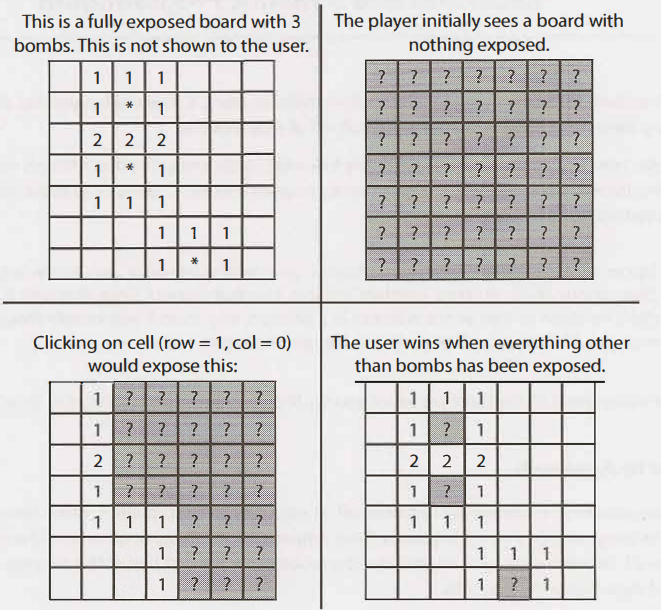

# Object-Oriented Design `Java`

## 1. Deck of Cards

Design the data structures for a generic deck of cards. Explain how you would subclass the data structures to implement blackjack.

## 2. Call Center

Imagine you have a call center with three levels of employees: respondent, manager, and director. An incoming telephone call must be first
allocated to a respondent who is free. If the respondent can't handle the call, he or she must escalate the call to a manager. If the
manager is not free or not able to handle it, then the call should be escalated to a director. Design the classes and data structures for
this problem. Implement a method dispatchCall() which assigns a call to the first available employee.

## 3. Jukebox

Design a musical jukebox using object oriented principles.

## 4. Parking Lot

Design a parking lot using object-oriented principles.

## 5. Online Book Reader

Design the data structures for an online book reader system.

## 6. Jigsaw

Implement an NxN jigsaw puzzle. Design the data structures and explain an algorithm to solve the puzzle. You can assume that you have a
fitsWith method which, when passed two puzzle edges, returns true if the two edges belong together.

## 7. Chat Server

Explain how you would design a chat server. In particular, provide details about the various backend components, classes, and methods. What
would be the hardest problems to solve?

## 8. Othello

Othello is played as follows: Each Othello piece is white on one side and black on the other. When a piece is surrounded by its opponents on
both the left and right sides, or both the top and bottom, it is said to be captured and its color is flipped. On your turn, you must
capture at least one of your opponent's pieces. The game ends when either user has no more valid moves. The win is assigned to the person
with the most pieces. Implement the object-oriented design for Othello.

## 9. Circular Array

Implement a CircularArray class that supports an array-like data structure which can be efficiently rotated. If possible, the class should
use a generic type (also called a template), and should support iteration via the standard f or `(Obj o : circularArray)` notation.

## 10. Minesweeper

Design and implement a text-based Minesweeper game. Minesweeper is the classic single-player computer game where an NxN grid has B mines (
or bombs) hidden across the grid. The remaining cells are either blank or have a number behind them. The numbers reflect the number of bombs
in the surrounding eight cells. The user then uncovers a cell. If it is a bomb, the player loses. If it is a number, the number is exposed.
If it is a blank cell, this cell and all adjacent blank cells (up to and including the surrounding numeric cells) are exposed. The player
wins when all non-bomb cells are exposed. The player can also flag certain places as potential bombs. This doesn't affect game play, other
than to block the user from accidentally clicking a cell that is thought to have a bomb.
(Tip for the reader: if you're not familiar with this game, please play a few rounds on line first.)

## 11. File System

Explain the data structures and algorithms that you would use to design an in-memory file system. Illustrate with an example in code where
possible.

## 12. Hash Table

Design and implement a hash table which uses chaining (linked lists) to handle collisions.

